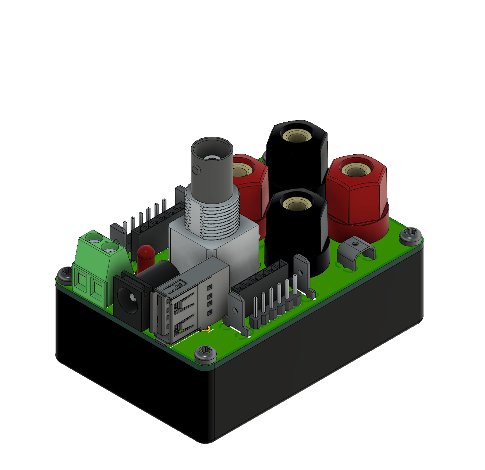

# Adapter Box

A simple multiconnector Adapter Box to hopefully fulfill all connection needs. It features 2 Channels (e.g. +/-) and the following connectors:

- 1x 5.5mm / 2.1mm DC-Jack (center positive)
- 1x USB-A
- 1x Phoenix Contact MKDSN Screw Terminals (0.2" / 5.08mm Pitch)
- 4x (2 per Channel) 4mm Banana Jack
- 4x (2 per Channel) 6.3mm Spade Terminal Connector
- 2x (1 per Channel) 5.5mm / 6.3mm Contact Point (e.g. for Crocodile Clips)
- 1x BNC (vertical mounting)
- 12x (6 per Channel) Female Pinheader (0.1" / 2,57mm Pitch)
- 12x (6 per Channel) Male Pinheader (0.1" / 2,57mm Pitch)
- 1x Power LED

The Power LED is driven my an LM334 constant current source that can handle up to 40V and 20V in reverse polarity. If you plan on going any higher, don't populate the components.

## Renders
### Assembly

### Board
#### Topside:

#### Bottomside:

### BOM
For a Spreadsheet BOM, see [BOM.xlsx](BOM.xlsx).

The full BOM is currently only available from CONRAD Electronic, however for most Parts you should be able to easily find a replacement (see the Spreadsheet for some Digikey Part#s). Only the Case could be a bit hard to find elsewhere, but it is not mandatory to have (make one from Acrylic sheets for example).

|                    | Qty | Manufacturer      | Manufacturer Part No. | Order-No.    | Price (1) | Price (10) | Extended Price (1) |
|--------------------|-----|-------------------|-----------------------|--------------|-----------|------------|--------------------|
| BNC Jack           | 1   | TRU-Components    | 730413                | 1566143 - 62 | 3,44      | 3,24       | 3,44               |
| Case               | 1   | TRU-Components    | TC-2024 SW203         | 1588559 - 62 | 2,86      | 2,74       | 2,86               |
| Connector Straight | 4   | TE Connectivity   | 726386-2              | 808428 - 62  | 0,21      | 0,19       | 0,84               |
| Connector Bridge   | 2   | Vogt              | 1098a.68              | 739844 - 62  | 0,09      | 0,08       | 0,18               |
| Pinheader Female   | 2   | Connfly           | 1498356               | 1498356 - 62 | 0,12      | 0,09       | 0,24               |
| Pinheader Male     | 2   | Connfly           | 1390113               | 1390113 - 62 | 0,12      | 0,09       | 0,24               |
| Contact Plug       | 1   | Phoenix Contact   | 1758018               | 743603 - 62  | 0,42      | 0,41       | 0,42               |
| USB-A              | 1   | econ-connect      | USBBUVA               | 1311468 - 62 | 0,91      | 0,85       | 0,91               |
| Contact Screw      | 1   | Phoenix Contact   | 1729018               | 743530 - 62  | 0,54      | 0,52       | 0,54               |
| Banana Jack Black  | 2   | Schützinger       | BU 403 sz             | 737657 - 62  | 1,3       | 1,18       | 2,6                |
| Banana Jack Red    | 2   | Schützinger       | BU 403 rt             | 737672 - 62  | 1,3       | 1,18       | 2,6                |
| DC Jack            | 1   | TRU-Components    | 1582643               | 1582643 - 62 | 0,68      | 0,62       | 0,68               |
| LM334              | 1   | Texas Instruments | LM334M/NOPB           | 1014051 - 62 | 0,65      | 0,58       | 0,65               |
| 36 Ohm 0603        | 1   | Samsung           | RC1608F36R0CS         | 436455 - 62  | 0,02      | 0,02       | 0,02               |
| 100 Ohm 0603       | 1   | TRU-Components    | 1585242               | 1585242 - 62 | 0,02      | 0,02       | 0,02               |
| BC807              | 1   | Nexperia          | BC807-25,215          | 1112884 - 62 | 0,2       | 0,19       | 0,2                |
| Power LED          | 1   | Kingbright        | L 53 LID              | 146005 - 62  | 0,13      | 0,12       | 0,13               |
|                    |     |                   |                       |              |           |            |                    |
|                    |     |                   |                       |              |           | **Total**  | **16,2**           |
