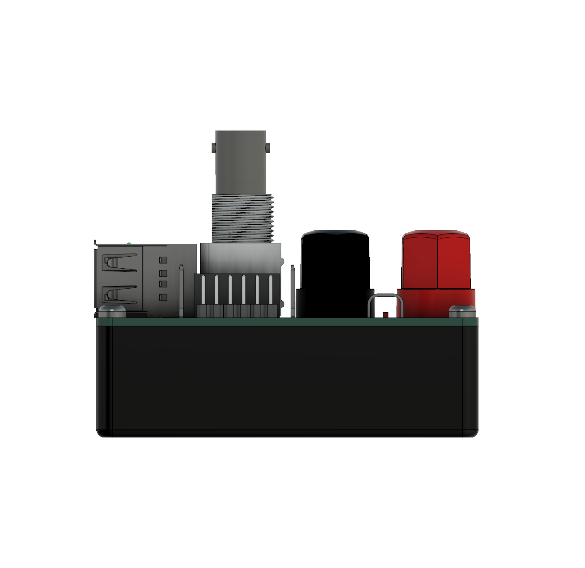
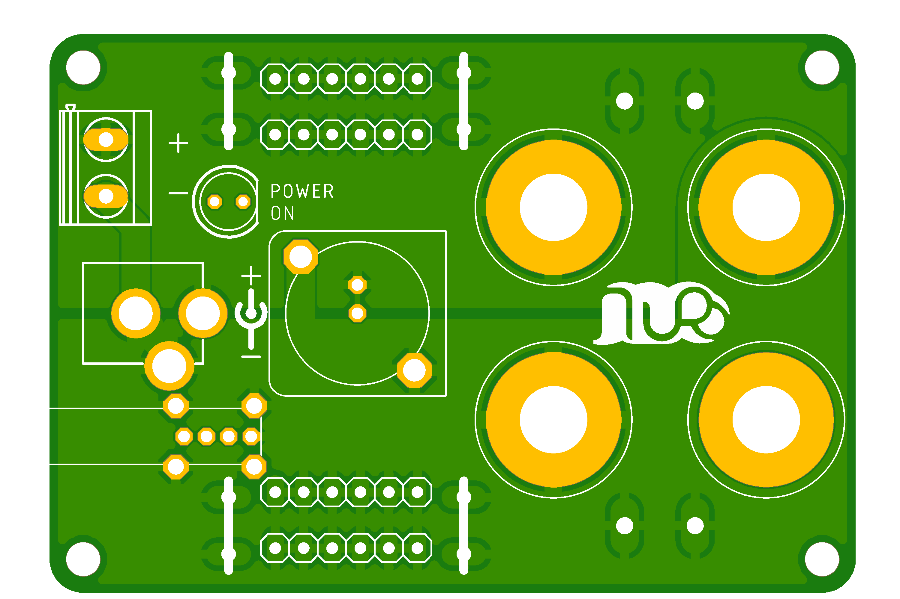
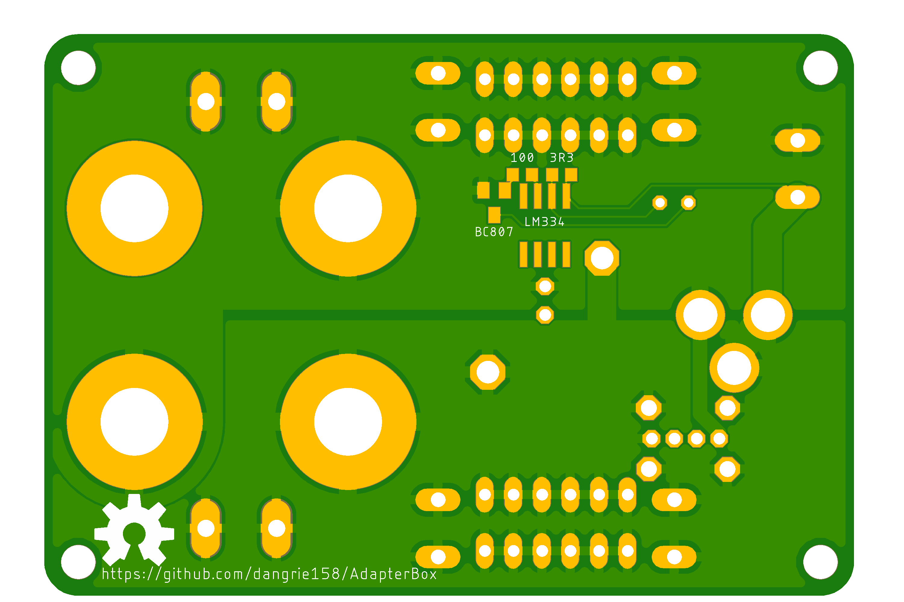

# Adapter Box

A simple multiconnector Adapter Box to hopefully fulfill all connection needs. It features 2 Channels (e.g. +/-) and the following connectors:

- 1x 5.5mm / 2.1mm DC-Jack (center positive)
- 1x Phoenix Contact MSTBV Socket for Pluggable Screw Terminals (0.2" / 5.08mm Pitch)
- 1x Phoenix Contact MKDSN Screw Terminals (0.2" / 5.08mm Pitch)
- 4x (2 per Channel) 4mm Banana Jack
- 4x (2 per Channel) 6.3mm Spade Terminal Connector
- 2x (1 per Channel) 5.5mm / 6.3mm Contact Point (e.g. for Crocodile Clips)
- 1x BNC (vertical mounting)
- 12x (6 per Channel) Female Pinheader (0.1" / 2,57mm Pitch)
- 12x (6 per Channel) Male Pinheader (0.1" / 2,57mm Pitch)

## Renders
### Assembly

### Board
#### Topside:

#### Bottomside:

### BOM
For a Spreadsheet BOM, see [BOM.xlsx](BOM.xlsx).

The full BOM is currently only available from CONRAD Electronic, however for most Parts you should be able to easily find a replacement (see the Spreadsheet for some Digikey Part#s). Only the Case could be a bit hard to find elsewhere, but it is not mandatory to have (make one from Acrylic sheets for example).

|                    | Qty | Manufacturer    | Manufacturer Part No. | Order-No.         | Price (1) [€] | Price (10) [€] |
|--------------------|-----|-----------------|-----------------------|-------------------|---------------|----------------|
| BNC Jack           | 1   | TRU-Components  | 730413                | 1566143 - 62      | 3,44          | 3,24           |
| Case               | 1   | TRU-Components  | TC-2024 SW203         | 1588559 - 62      | 2,86          | 2,74           |
| Connector Straight | 4   | TE Connectivity | 726386-2              | 808428 - 62       | 0,21          | 0,19           |
| Connector Bridge   | 2   | Vogt            | 1098a.68              | 739844 - 62       | 0,09          | 0,08           |
| Pinheader Female   | 2   | Connfly         | 1498356               | 1498356 - 62      | 0,12          | 0,09           |
| Pinheader Male     | 2   | Connfly         | 1390113               | 1390113 - 62      | 0,12          | 0,09           |
| Contact Plug       | 1   | Phoenix Contact | 1758018               | 743603 - 62       | 0,42          | 0,41           |
| Contact Screw      | 1   | Phoenix Contact | 1729018               | 743530 - 62       | 0,54          | 0,52           |
| Banana Jack Black  | 2   | Schützinger     | BU 403 sz             | 737657 - 62       | 1,3           | 1,18           |
| Banana Jack Red    | 2   | Schützinger     | BU 403 rt             | 737672 - 62       | 1,3           | 1,18           |
| DC Jack            | 1   | TRU-Components  | 1582643               | 1582643 - 62      | 0,68          | 0,62           |
|                    |     |                 |                       | **Total**         | **14,64**     |                |
